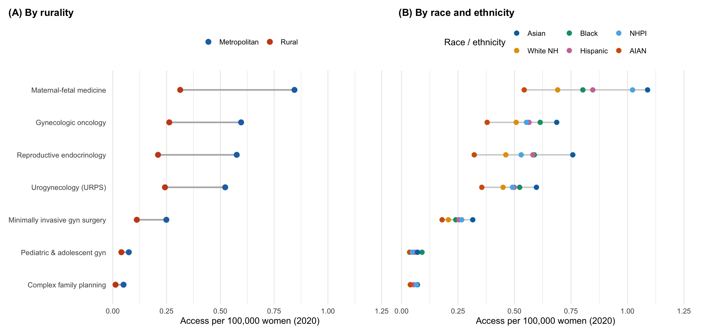
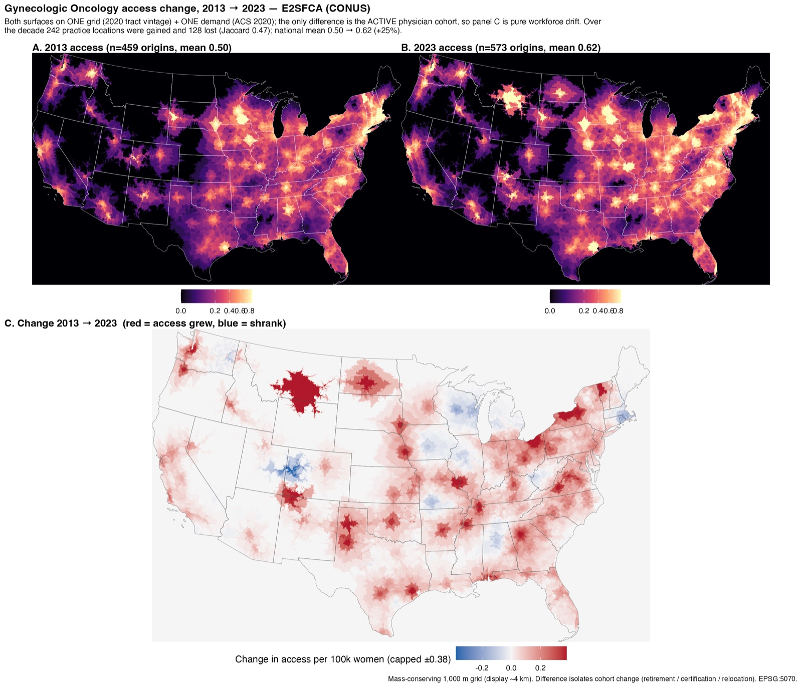
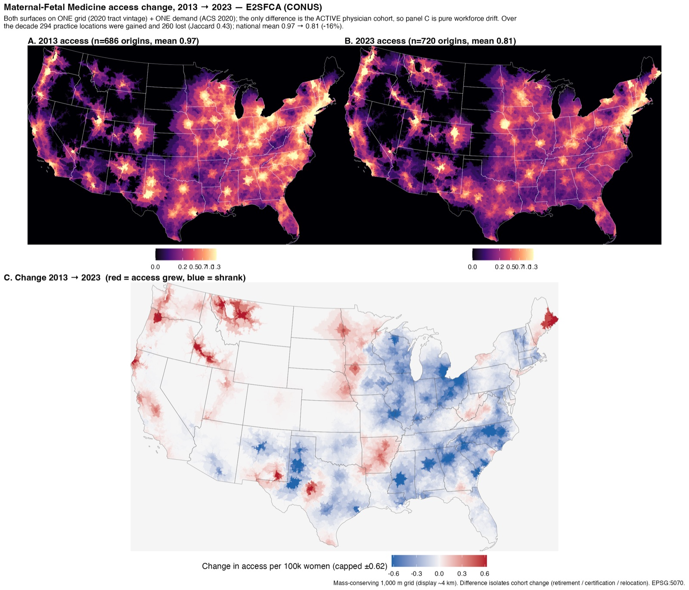
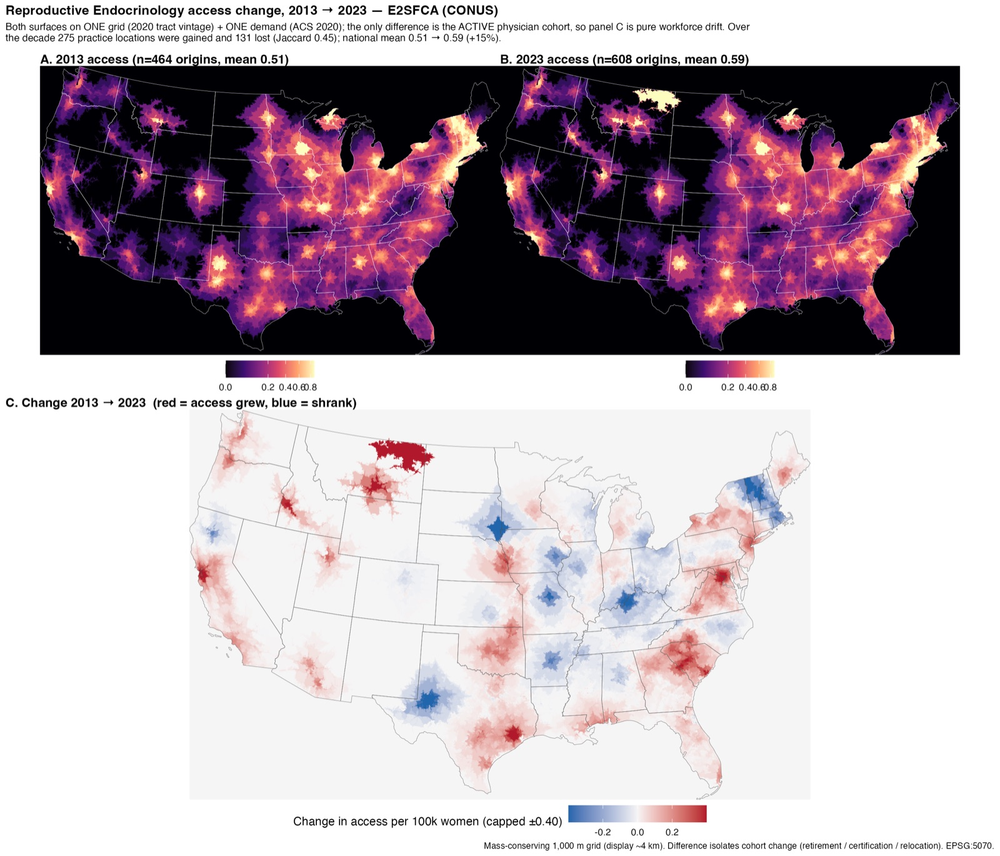
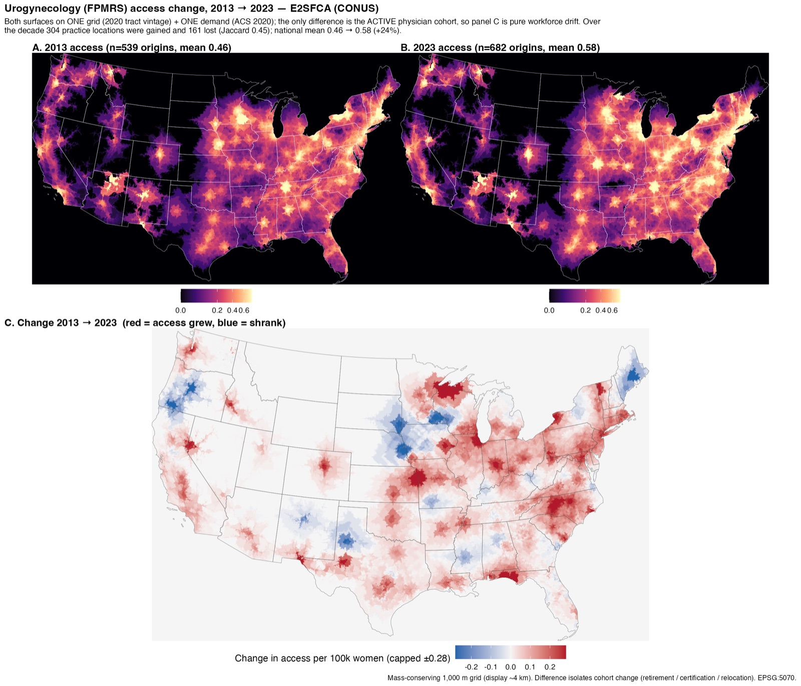
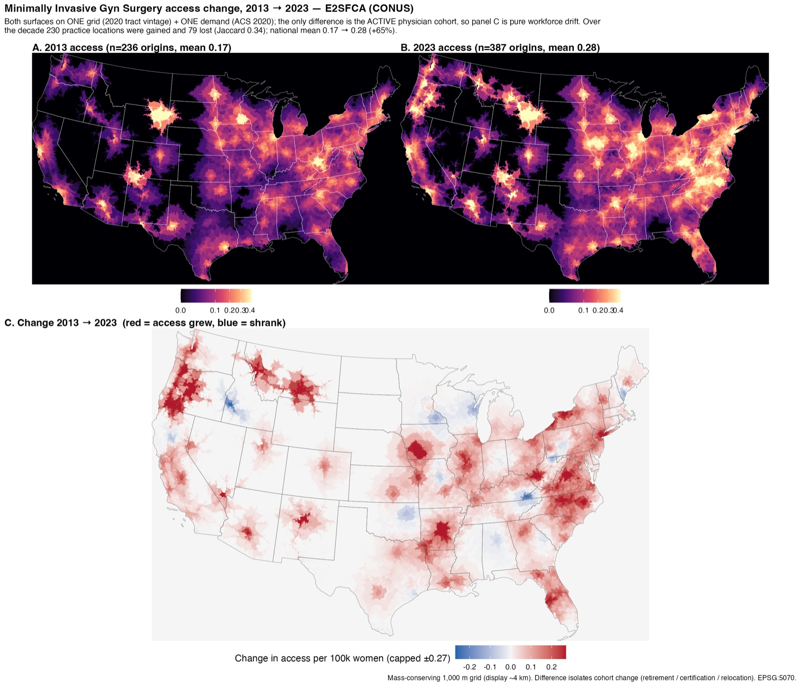
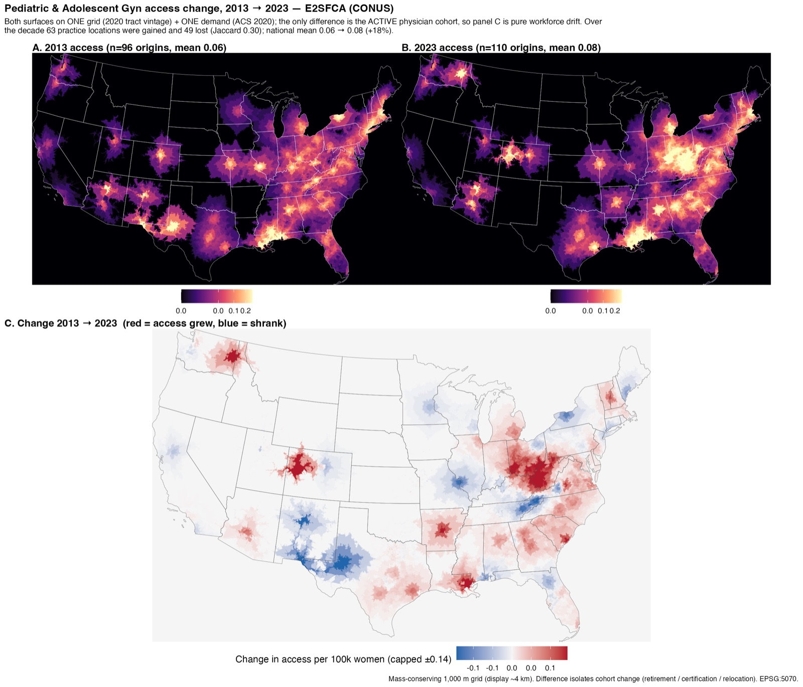
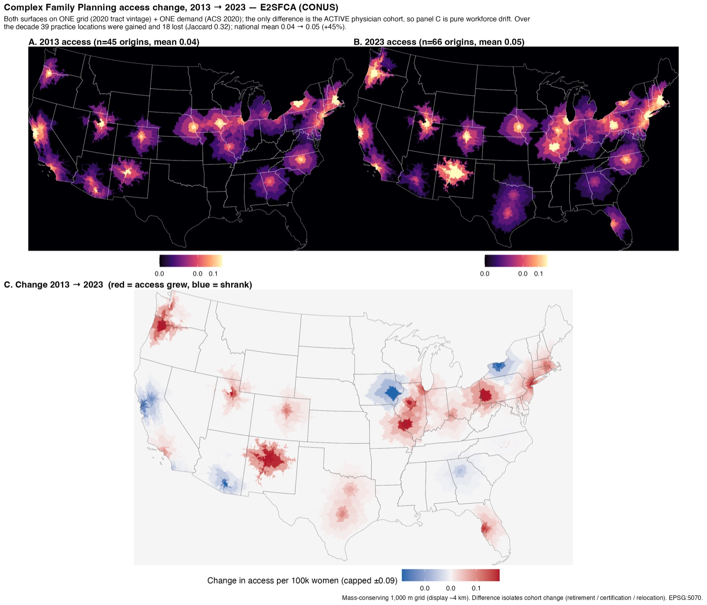

# twostep — E2SFCA accessibility to OB/GYN subspecialists

<!-- badges: start -->
[](LICENSE)
[](https://lifecycle.r-lib.org/articles/stages.html#experimental)
[](DESCRIPTION)
[](https://cran.r-project.org/)
<!-- badges: end -->

Standalone analysis and manuscript for **national travel-time accessibility to the
seven ABOG-certified obstetric and gynecologic subspecialties** across the
contiguous United States, 2013–2023, using an **Enhanced Two-Step Floating
Catchment Area (E2SFCA)** method on road-network isochrones with a mass-conserving
demand allocation and a Spatial Access Ratio (SPAR).

This repository was extracted from the larger **isochrones** pipeline
(<https://github.com/mufflyt/isochrones>, private) so the accessibility paper builds
and reproduces on its own, independent of the physician-distribution and
workforce-cliff work. isochrones is the **source of record** that generates the
road-network isochrones, the physician cohort, and the accessibility artifacts;
twostep vends the small frozen subset those produce, so the manuscript renders with
no network access — its only external code dependency is the
[`mufflyaccess`](https://github.com/mufflyt/mufflyaccess) package (data lineage in
[`docs/DATA_PROVENANCE.md`](docs/DATA_PROVENANCE.md)).

## Workforce counts, the URPS contract, and year handling

Table 1's provider counts and standardized supply are derived from the frozen
E2SFCA national summary (`e2sfca_national_summary.csv`) by the method's
conservation identity, `n = mean_per_100k × ACS_female_pop ÷ 100,000`; the loaders
in `scripts/manuscript_e2sfca_values.R` re-derive and cross-check them against that
frozen run (fail-closed on any disagreement > 1).

The urogynecology and reconstructive pelvic surgery (URPS) cross-reference footnote
reports the canonical board-certified-active workforce served by
[`mufflyaccess`](https://github.com/mufflyt/mufflyaccess) (≥ 0.10.0, contract
v3.0.0) via `mufflyaccess::urps_count()`: **1,306 nationally and 1,303 in the
contiguous United States for 2023**. twostep is a *consumer* of that contract, not
its owner.

Four distinct years appear in this paper and are not interchangeable — the README
and manuscript name the year explicitly rather than saying "current":

| Quantity | Year | Source |
|---|---|---|
| Headline active workforce + standardized supply (Table 1) | **2022** | frozen E2SFCA national summary |
| URPS board-certified-active workforce (footnote) | **2023** | `mufflyaccess::urps_count()` (1,306 national / 1,303 CONUS) |
| Spatial-distribution / disparity analysis (Table 2, Figures 3–6) and the Figure 1 image | **2020** | 2020-vintage frozen artifacts |
| ACS demand denominator for the 2022 headline | **2022 ACS 5-year** | ACS 2018–2022, Table B01001 |

## Status and open items

- **Figure 1 is still the 2020 access surface.** Table 1's headline moved to 2022,
  but Figure 1 (`manuscript/figures/fig0_level2020.jpg`) has **not** been
  regenerated: its per-panel means are 2020 values and will disagree with Table 1's
  2022 supply column until the production pipeline produces the validated 2022
  surface. It is not a 2022 figure yet and must not be described as one.
- **The detailed disparity analysis remains 2020.** Table 2 (% outside 60/120/180
  min; Gini), Figures 3–6, and their Results prose are computed on the 2020 spatial
  artifacts and are labeled 2020. They are unaffected by the Table 1 headline move
  and stay 2020 unless and until they are regenerated.

## Figures

These are the figures the manuscript renders (shipped in `manuscript/figures/` and
embedded by the render). Every figure was generated in the upstream isochrones
pipeline and staged into this repo; **which script produced each figure, from which
data, and on what day is documented in
[`docs/FIGURE_PROVENANCE.md`](docs/FIGURE_PROVENANCE.md)** (machine-readable copy at
[`manuscript/figures/FIGURE_PROVENANCE.csv`](manuscript/figures/FIGURE_PROVENANCE.csv)).
Note the file name does not match the figure number (for example Figure 5 is
`fig4_gotrends.jpg`); resolve by that table. Figure 3 is generated by a
twostep-native script (`scripts/figure3_allsubspec_stratified_2020.R`) and two more
generators are vendored in `scripts/` (Figures 2 and 4); the remaining four are
isochrones-only. The seven
supplemental per-subspecialty access-change maps (Figures S1 to S7) are shown under
[Supplemental figures](#supplemental-figures-s1-to-s7) below and in the rendered HTML.

**Figure 1. Potential accessibility to each of the seven OB/GYN subspecialties, 2020** (per 100,000 women). *Still the 2020 surface; pending regeneration to 2022 — see [Status and open items](#status-and-open-items).*


**Figure 2. National potential accessibility by subspecialty** (population-weighted mean and distribution).


**Figure 3. Potential accessibility in 2020 to all seven OB/GYN subspecialties, by (A) rurality and (B) race and ethnicity** (population-weighted per 100,000 women).



**Figure 4. Access for disadvantaged groups relative to their reference group, across all seven subspecialties** (equity heatmap).


**Figure 5. Trends in gynecologic oncology accessibility disparities, 2013 to 2023.**


**Figure 6. Change in the share of (A) rural and (B) American Indian or Alaska Native residents with zero modeled access.**


**Figure 7. Change in potential accessibility by subspecialty, 2013 to 2023.**


## Supplemental figures (S1 to S7)

Per-subspecialty access **change**, 2013 to 2023 (Figures S1 to S7). Both endpoints are
computed on a single 2020 grid and demand so the difference isolates the change in
the active workforce, not the demand denominator. These also render in the
manuscript HTML.

**Figure S1. Gynecologic oncology**, access change 2013 to 2023.



**Figure S2. Maternal-fetal medicine**, access change 2013 to 2023.



**Figure S3. Reproductive endocrinology and infertility**, access change 2013 to 2023.



**Figure S4. Urogynecology and reconstructive pelvic surgery (URPS)**, access change 2013 to 2023.



**Figure S5. Minimally invasive gynecologic surgery**, access change 2013 to 2023.



**Figure S6. Pediatric and adolescent gynecology**, access change 2013 to 2023.



**Figure S7. Complex family planning**, access change 2013 to 2023.



## Reproduce the manuscript

```r
# from the repo root — one time, to install the exact pinned package versions
Rscript -e 'renv::restore()'

# then render
Rscript render.R
# -> manuscript/e2sfca_accessibility_manuscript.html (self-contained)
```

Package versions are pinned in `renv.lock` (renv activates automatically via
`.Rprofile`), so the render and tests are hermetic down to the package version.
The render uses `rmarkdown`, `knitr`, `kableExtra`, `dplyr`, `tidyr`, `purrr`,
`tibble`, `readr`, `jsonlite`, `here`, and the shared single-source-of-truth
package **`mufflyaccess`** (public, pinned in `renv.lock`), which supplies the
shared band/geography/denominator constants and the 2023 URPS workforce
cross-reference; the tests add `testthat`, `sf`, `terra`, `exactextractr`,
`checkmate`, `rprojroot`, and the HAC trend producer uses `sandwich`/`lmtest`.
`renv::restore()` installs all of these, including `mufflyaccess` from GitHub, so
no manual setup is needed and no other network access is required at render time.
All manuscript inputs are the small CSV/RDS/JSON files under `artifacts/2sfca/**`,
`manuscript/data/`, and the figures under `manuscript/figures/`.

## Run the method tests

```r
Rscript tests/testthat.R
```

The 25 test files (765 checks) pin the engine's analytic behavior (E2SFCA vs
M2SFCA, the distance-decay weights, zero-demand NA semantics, SPAR, and the
population-weighted disparity estimators), the single-source-of-truth constants and
their agreement with the shared `mufflyaccess` package, the frozen-run provenance
guards, and the consumer-contract and non-normative-access-language guards. They use
inline fixtures only (no network or external data).

## Layout

```
manuscript/   e2sfca_accessibility_manuscript.Rmd + bibs + green-journal.csl + figures/ + data/
R/            two_step_floating_catchment.R (engine), accessibility_stratification.R (stats SSOT), utils/
scripts/      manuscript_e2sfca_values.R (canonical loaders used by the Rmd) + analysis/figure scripts
artifacts/    frozen E2SFCA run outputs the manuscript reads (run e2sfca_20260712_190734)
docs/         RUNBOOK_E2SFCA_ACCESSIBILITY.md
tests/        testthat suite for the engine + stratification SSOT
```

## Method sources

Every function in `R/two_step_floating_catchment.R` carries a `@references` tag; the
module header has the full citation sheet (Luo & Wang 2003; Luo & Qi 2009;
Delamater 2013 M2SFCA; Wan et al. 2012 SPAR; McGrail 2009/2012; Apparicio et al.
2017; and others) mapped to the function each grounds. `docs/RUNBOOK_E2SFCA_ACCESSIBILITY.md`
documents the production run, gates, and frozen facts.

## Provenance and scope

- **Frozen run:** `e2sfca_20260712_190734` (raster engine, 500 m EPSG:5070, 77/77
  subspecialty-year cells, conservation to 1e-14). Every frozen artifact used by the
  manuscript, its provenance, and what it feeds are documented in
  [`docs/DATA_PROVENANCE.md`](docs/DATA_PROVENANCE.md); their SHA-256 checksums are
  pinned in [`SHA256SUMS.txt`](SHA256SUMS.txt) (`shasum -a 256 -c SHA256SUMS.txt`).
- **Analysis scripts vs manuscript:** the manuscript reproduces from the frozen
  output artifacts here. The heavy generation scripts (`scripts/run_2sfca.R`,
  `sensitivity_e2sfca_2020.R`, the map/seam scripts) are included for provenance
  but consume upstream pipeline inputs (isochrones, the year-cohort panel, ACS
  bundle) that are **not** shipped in this repo; they document how the artifacts
  were produced rather than re-running end to end here.
- **Upstream pipeline (source of record):** the frozen artifacts, and the inputs the
  generation scripts consume, are created and maintained in the isochrones pipeline
  (<https://github.com/mufflyt/isochrones>, private; source commit `ff3aac4a`).
  twostep vends a frozen, checksummed subset of that pipeline's output; you do **not**
  need access to isochrones to reproduce the manuscript from this repo.
- **Regenerating the shipped outputs:** the scripts that produced twostep's
  committed artifacts/figures are now included, so outputs are regenerable rather
  than only frozen, e.g. `scripts/spatial_outcomes_2020.R` -> `spatial_outcomes_2020.csv`,
  `scripts/map_equity_heatmap.R`, and `scripts/map_allsubspec_allyears_access_surface.R`.
  The per-subspecialty E2SFCA access-surface maps are in
  `artifacts/2sfca_seam/figures/`, and `scripts/check_wordcount.R` audits the
  rendered main-text word count. Like the other generation scripts, most consume
  upstream inputs not shipped here (see the analysis-scripts note above).
- **Geographic scope:** contiguous U.S. (48 states + DC). Alaska and Hawaii are
  outside the road-network modeling framework; see the manuscript's limitations.

---

## Installation

```r
# install.packages("remotes")
remotes::install_github("mufflyt/mufflyaccess")   # required dependency
remotes::install_github("mufflyt/twostep")
```

The package carries an `renv` lockfile. Running `R CMD INSTALL` or `Rscript`
**from inside the repository** activates that isolated library, which will not
contain your other packages; install from the parent directory, or set
`RENV_CONFIG_AUTOLOADER_ENABLED=FALSE`, if dependencies appear to be missing.

## Vocabulary guard

The package refuses normative language on accessibility results, because an
accessibility surface without a defensible demand target cannot support claims
about adequacy:

```r
ACCESS_FORBIDDEN_TERMS
#> "shortage" "surplus" "adequacy" "adequate" "inadequate" "unmet need" ...

assert_access_language("Counties with an inadequate supply")   # stops
assert_access_language("Modeled accessibility by county")      # passes
```

Wire it into the render, not into a review checklist — it is cheap to call on
every caption, legend title and layer name before a figure is written.

## How to cite

```r
citation("twostep")
```

`CITATION.cff` and `CITATION.bib` carry the same entry for GitHub and reference
managers. ORCID [0000-0002-2044-1693](https://orcid.org/0000-0002-2044-1693).

## Licence

MIT — see [LICENSE.md](LICENSE.md).

## Related

| Package | Owns |
|---|---|
| [`mufflyaccess`](https://github.com/mufflyt/mufflyaccess) | constants and safe arithmetic: bands, CONUS geography, `safe_rate()` |
| [`isochrones`](https://github.com/mufflyt/isochrones) | routing, water masks, the isochrone pipeline (source of record) |
| [`mysterymaps`](https://github.com/mufflyt/mysterymaps) | map construction |
| [`cliff`](https://github.com/mufflyt/cliff) | workforce retirement modelling |
