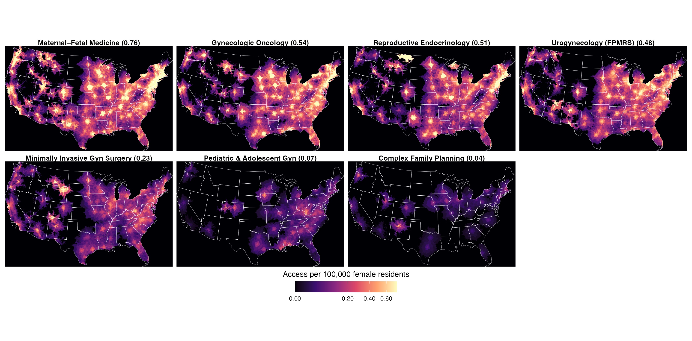
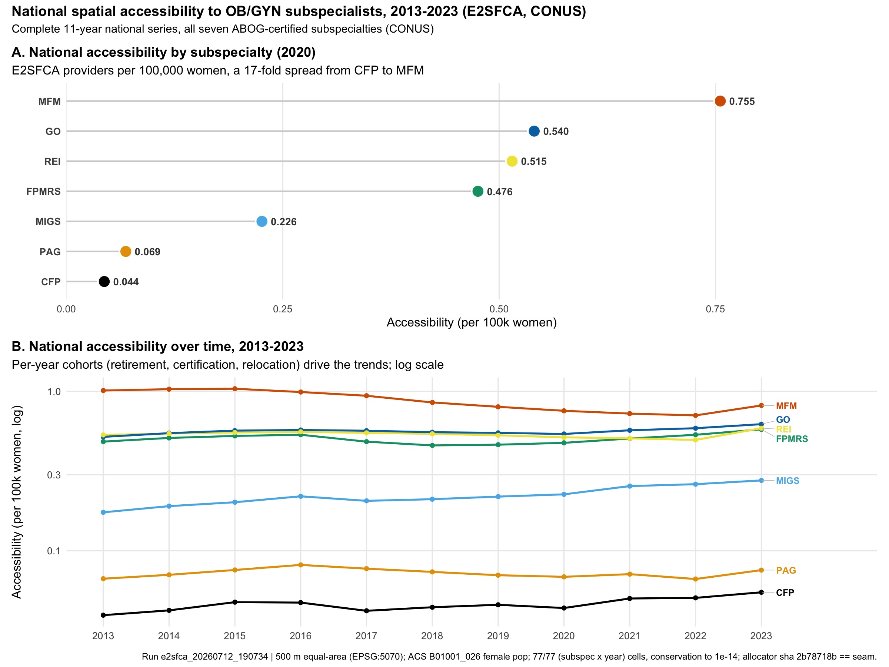
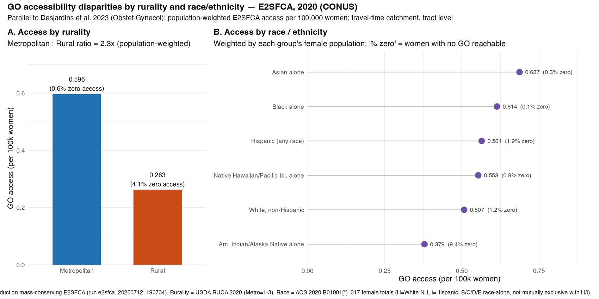
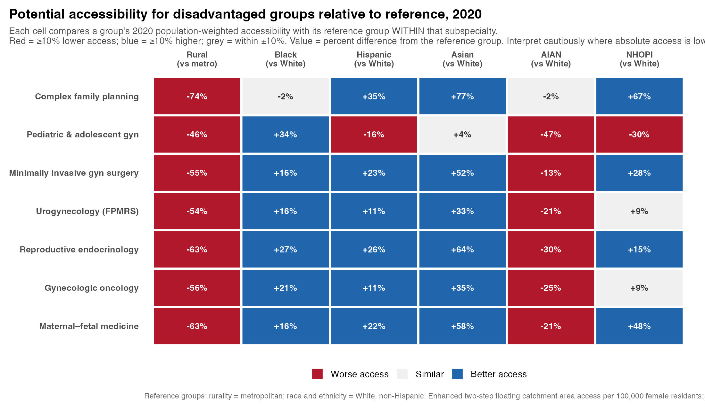
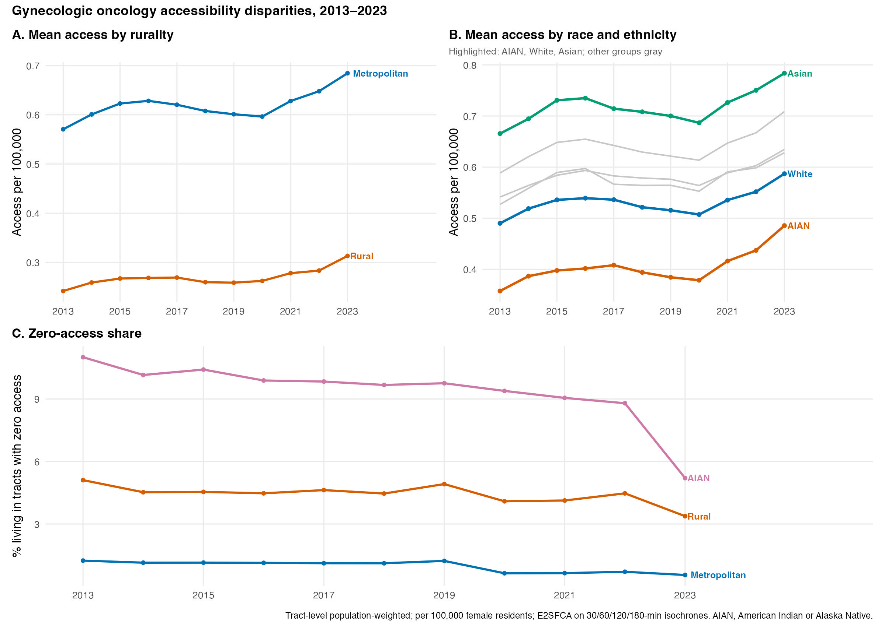
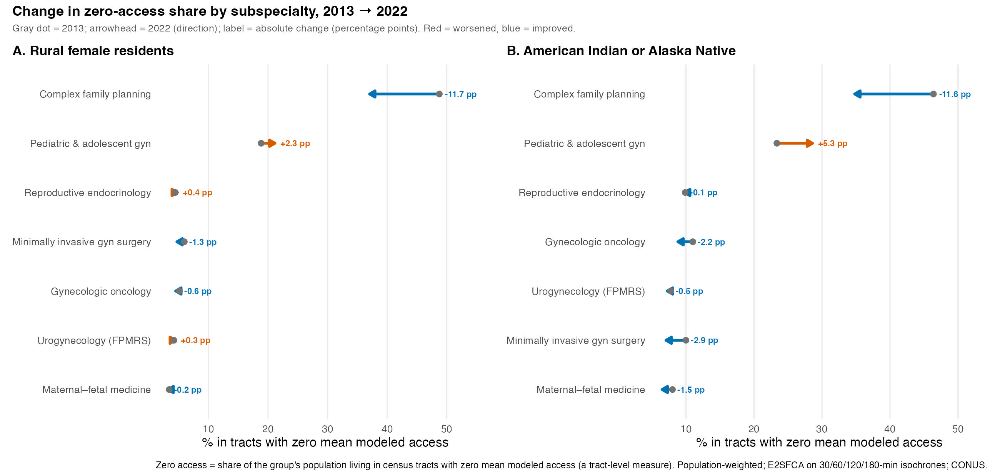
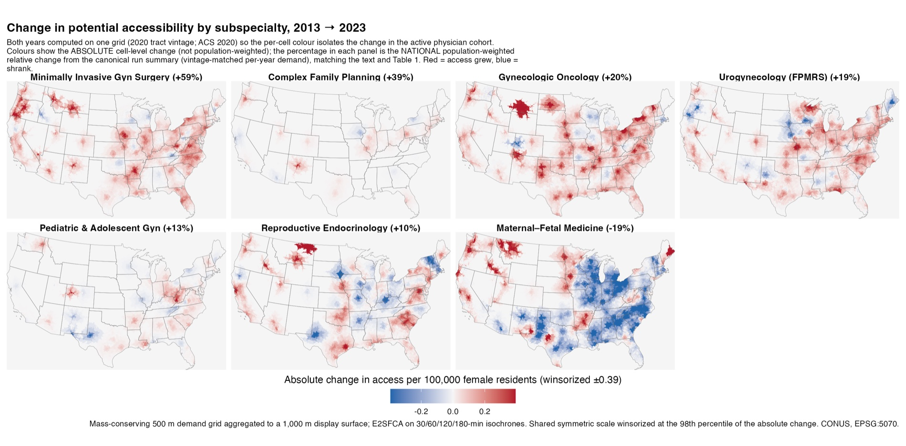

# twostep — E2SFCA accessibility to OB/GYN subspecialists

Standalone analysis and manuscript for **national travel-time accessibility to the
seven ABOG-certified obstetric and gynecologic subspecialties** across the
contiguous United States, 2013–2023, using an **Enhanced Two-Step Floating
Catchment Area (E2SFCA)** method on road-network isochrones with a mass-conserving
demand allocation and a Spatial Access Ratio (SPAR).

This repository was extracted from the larger `isochrones` pipeline so the
accessibility paper builds and reproduces on its own, independent of the physician
distribution / workforce-cliff work. The manuscript renders entirely from the
frozen artifacts shipped here — no upstream pipeline or network access needed.

## Figures

These are the figures the manuscript renders (shipped in `manuscript/figures/` and
embedded by the render; the generating scripts `scripts/figure_*` and `scripts/map_*`
are included for provenance). Seven supplemental per-subspecialty access-change maps
(Figures S1 to S7) also appear in the rendered HTML.

**Figure 1. Potential accessibility to each of the seven OB/GYN subspecialties, 2020** (per 100,000 women).



**Figure 2. National potential accessibility by subspecialty** (population-weighted mean and distribution).



**Figure 3. Gynecologic oncology accessibility in 2020, by (A) rurality and (B) race and ethnicity.**



**Figure 4. Access for disadvantaged groups relative to their reference group, across all seven subspecialties** (equity heatmap).



**Figure 5. Trends in gynecologic oncology accessibility disparities, 2013 to 2023.**



**Figure 6. Change in the share of (A) rural and (B) American Indian or Alaska Native residents with zero modeled access.**



**Figure 7. Change in potential accessibility by subspecialty, 2013 to 2023.**



## Reproduce the manuscript

```r
# from the repo root — one time, to install the exact pinned package versions
Rscript -e 'renv::restore()'

# then render
Rscript render.R
# -> manuscript/e2sfca_accessibility_manuscript.html (self-contained)
```

Package versions are pinned in `renv.lock` (renv activates automatically via
`.Rprofile`), so the render and tests are hermetic down to the package version.
The render itself uses `rmarkdown`, `knitr`, `kableExtra`, `dplyr`, `tidyr`,
`purrr`, `tibble`, `readr`, `jsonlite`, `here`; the tests add `testthat`, `sf`,
`terra`, `exactextractr`, `checkmate`, `rprojroot`. All manuscript inputs are the
small CSV/RDS/JSON files under `artifacts/2sfca/**`, `manuscript/data/`, and the
figures under `manuscript/figures/`.

## Run the method tests

```r
Rscript tests/testthat.R
```

The three test files pin the engine's analytic behavior (E2SFCA vs M2SFCA
`diff(W^2)`, Gaussian-derived zonal decay, zero-demand NA semantics, SPAR, and the
population-weighted disparity estimators). They use inline fixtures only.

## Layout

```
manuscript/   e2sfca_accessibility_manuscript.Rmd + bibs + green-journal.csl + figures/ + data/
R/            two_step_floating_catchment.R (engine), accessibility_stratification.R (stats SSOT), utils/
scripts/      manuscript_e2sfca_values.R (canonical loaders used by the Rmd) + analysis/figure scripts
artifacts/    frozen E2SFCA run outputs the manuscript reads (run e2sfca_20260712_190734)
docs/         RUNBOOK_E2SFCA_ACCESSIBILITY.md
tests/        testthat suite for the engine + stratification SSOT
```

## Method sources

Every function in `R/two_step_floating_catchment.R` carries a `@references` tag; the
module header has the full citation sheet (Luo & Wang 2003; Luo & Qi 2009;
Delamater 2013 M2SFCA; Wan et al. 2012 SPAR; McGrail 2009/2012; Apparicio et al.
2017; and others) mapped to the function each grounds. `docs/RUNBOOK_E2SFCA_ACCESSIBILITY.md`
documents the production run, gates, and frozen facts.

## Provenance and scope

- **Frozen run:** `e2sfca_20260712_190734` (raster engine, 500 m EPSG:5070, 77/77
  subspecialty-year cells, conservation to 1e-14). Every frozen artifact used by the
  manuscript, its provenance, and what it feeds are documented in
  [`docs/DATA_PROVENANCE.md`](docs/DATA_PROVENANCE.md); their SHA-256 checksums are
  pinned in [`SHA256SUMS.txt`](SHA256SUMS.txt) (`shasum -a 256 -c SHA256SUMS.txt`).
- **Analysis scripts vs manuscript:** the manuscript reproduces from the frozen
  output artifacts here. The heavy generation scripts (`scripts/run_2sfca.R`,
  `sensitivity_e2sfca_2020.R`, the map/seam scripts) are included for provenance
  but consume upstream pipeline inputs (isochrones, the year-cohort panel, ACS
  bundle) that are **not** shipped in this repo; they document how the artifacts
  were produced rather than re-running end to end here.
- **Geographic scope:** contiguous U.S. (48 states + DC). Alaska and Hawaii are
  outside the road-network modeling framework; see the manuscript's limitations.
