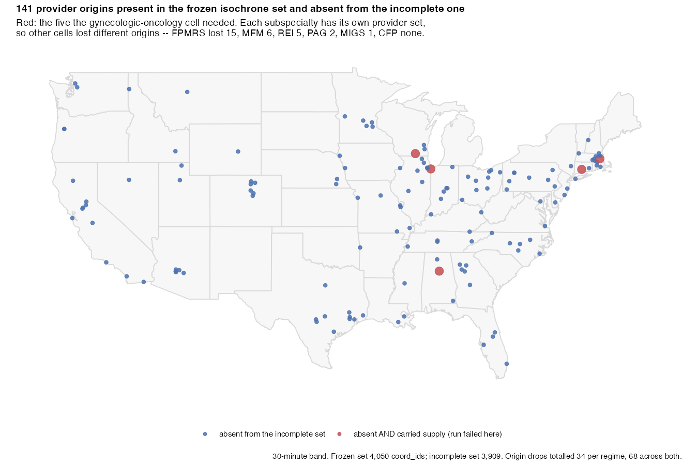

# Appendix: the frozen isochrone set, and why it is served by hash

**Status:** current as of `f986c97` (2026-08-29). Every gate named here passes.

This appendix documents an input that has no other written record in this
repository, and a defect that reached computed results because of it. It exists
because the failure was **silent**: nothing errored, nothing looked wrong, and
the corrupted numbers were internally consistent for four days.

Related: [`docs/DATA_PROVENANCE.md`](DATA_PROVENANCE.md) (what every input is),
[`docs/SSOT_LEDGER.md`](SSOT_LEDGER.md) (which constants are owned where),
[`manuscript/appendix_age_matched_denominators.Rmd`](../manuscript/appendix_age_matched_denominators.Rmd)
(the scientific appendix, which reports the correction's effect on the results).

---

## 1. What the frozen set is

The E2SFCA primary analysis is computed against one specific set of
road-network isochrones, generated by the upstream `isochrones` pipeline:

| property | value |
|---|---|
| run id | `e2sfca_20260712_190734` |
| bands | 30, 60, 120, 180 minutes |
| origins | **4,050** |
| files | 4 × `isochrones_<band>min_consolidated.rds` |
| total size | ~1.44 GiB |

It is **not** in this repository and never will be — it is three orders of
magnitude larger than everything else here combined. What ships is the checksum
manifest, [`inst/multiverse/frozen_isochrones.sha256`](../inst/multiverse/frozen_isochrones.sha256),
which is the actual object of record. The payload is retrievable; the identity
is not, so the identity is what gets version-controlled.

Canonical copies, both recorded in `mufflyaccess`'s `ssot_sources.json`:

```
s3://tmuffly-isochrone-library-163531628641/frozen/e2sfca_20260712_190734/
Dropbox: MufflyAccess_SSOT/frozen_isochrones/e2sfca_20260712_190734/
```

The EC2 launcher stages from a third location,
`s3://tyler-valhalla-tiles/seam_run/inputs/isochrones/`, which is where the set
was recovered from after the defect below.

## 2. The defect

At least nine directories on the author's machines and attached drives contain
files named `isochrones_30min_consolidated.rds` and its three siblings. They
have plausible sizes and identical structure. **None of the local ones is the
frozen set.**

The one the panel runner pointed at
(`/Users/tylermuffly/isochrones/artifacts/isochrones`, since archived) carries
**3,909 origins** against the frozen set's 4,050. The 141 it lacks include 44
physician locations.



The missing origins are **nationally scattered rather than clustered**, which is
part of why nothing looked wrong: a regional hole in the coverage map might have
been noticed by eye, 141 of 4,050 origins (3.48%) missing evenly everywhere was not.
That 3.48% is a share of *origins*; it is not the access shortfall tabulated below, and
the two are not interchangeable.
The map is computed, not drawn — coordinates alongside it at
[`figures/isochrone_missing_origins.csv`](figures/isochrone_missing_origins.csv)
so it can be checked rather than believed. (Figure and data by the concurrent
`samsung-drive-to-s3` session.)

The runner was configured `unmatched_supply_policy = "drop"`. So a physician
whose catchment was missing did not raise an error — that provider's supply was
removed from the numerator and the analysis continued to completion, producing a
complete-looking result with less supply than the study population actually had.

Because supply was only ever *removed*, every affected cell **understated**
access. The effect for the 2020 cross-section:

| subspecialty | origins | dropped | national mean understated by |
|---|---:|---:|---:|
| PAG | 95 | 2 | **3.54%** |
| FPMRS | 580 | 15 | 2.17% |
| GO | 516 | 5 | 0.79% |
| REI | 511 | 5 | 0.71% |
| MFM | 628 | 6 | 0.64% |
| MIGS | 326 | 1 | 0.27% |
| CFP | 53 | 0 | — |

Shortfall is expressed **relative to the corrected value**, `(corrected − contaminated) / corrected`,
which is the convention the scientific appendix uses; it reports the GO figure as
0.786% from 5 of 516 origins. Dividing by the contaminated value instead gives
slightly larger numbers (PAG 3.67%) and answers a different question.

These are **cell-level** counts, taken from `origins_dropped` in
[`artifacts/multiverse/age_matched_correction_diff.csv`](../artifacts/multiverse/age_matched_correction_diff.csv).
Each subspecialty has its own provider set, so a given missing catchment affects
only the subspecialties that had a provider there; the counts are not a partition
of one shared list.

Across both regimes: **12 of 14 cells affected, 68 dropped origins.** The
largest error, PAG, came from losing *two* origins out of 95 — small denominators
make small losses loud.

The consequence was not confined to levels. The corrected panel changes the
**C5 ordering claim**: under the contaminated 2020 the age-matched ordering read
`MFM > REI > GO > FPMRS > MIGS > PAG > CFP`; corrected it reads
`MFM > REI > GO > FPMRS > PAG > MIGS > CFP`. MIGS and PAG exchange rank on a
margin the supply loss manufactured. C2 (rural:metropolitan, max 0.5329) and C3
(AIAN:White, max 0.9567) were unaffected.

## 3. Why a path could not have fixed this

The obvious repair — point the runner at the right directory — fixes today's
instance and leaves the failure mode fully available tomorrow. Nothing about a
filesystem path tells you which isochrone set you have. Not the name, not the
size, not the modification time, not the row count.

This is the same lesson the RUCA file taught earlier in the same work: two RUCA
files with an **identical row count of 85,528** and different hashes, only one
correct. A row-count check would have passed on the wrong one. It was caught only
by insisting that the parameterised runner reproduce 2020 byte-for-byte.

So the interface changed from *naming* the input to *verifying* it.

## 4. The fix, in three layers

### 4.1 Fail closed instead of dropping

`tools/multiverse/run_age_matched.R` now sets
`unmatched_supply_policy = "error"`. A provider whose catchment is missing is a
stop, naming the offending IDs — not a quietly smaller numerator. This is the
single change that would have prevented the entire episode, and it costs
nothing when the inputs are right.

### 4.2 Verify by hash, before any compute

[`tools/ci/check_frozen_isochrones.sh`](../tools/ci/check_frozen_isochrones.sh)
hashes all four bands against the pinned manifest and refuses to proceed on a
mismatch, printing the recovery command. It runs on the EC2 launcher before the
first year executes, so a wrong set costs seconds rather than a twelve-hour run
and a retracted result.

[`tools/ci/check_supply_conservation.R`](../tools/ci/check_supply_conservation.R)
is the artifact-level backstop: it requires `n_iso_origins == n_supply_origins`
in every cell of every committed result. It is deliberately independent of the
hash gate — it would catch supply loss arising from a cause the hash cannot see.
On first run it found 12 of 14 cells already failing.

### 4.3 Serve it as an SSOT, not an environment variable

`mufflyaccess` (≥ 0.10.0) exports four accessors backed by the same manifest:

| function | purpose |
|---|---|
| `verify_frozen_isochrones(dir)` | hash all four bands; error naming any that differ |
| `use_frozen_isochrones(dir)` | adopt a directory — verifies first, fails closed |
| `frozen_isochrones_dir()` | return the adopted directory, **verified**, or error |
| `frozen_isochrones_provenance()` | run id, origin count, canonical S3/Dropbox URIs |

Resolution order:

1. `use_frozen_isochrones("<dir>")` — explicit adoption
2. option `mufflyaccess.frozen_isochrones_dir`
3. env `MUFFLYACCESS_FROZEN_ISOCHRONES_DIR`
4. env `E2SFCA_ISO_DIR` — compatibility

`E2SFCA_ISO_DIR` still works, but it is now **verified rather than trusted**.
That distinction is the whole point: the old contract was "tell me where it is
and I will believe you," which is precisely how the wrong set got used.

The ABOG refresh roster (`refresh_merged.csv`, 79,398 rows) is served the same
way by `ssot_abog_refresh.R`, for the same reason.

## 5. Verifying a working copy

```bash
# fetch
aws s3 sync s3://tyler-valhalla-tiles/seam_run/inputs/isochrones/ "$E2SFCA_ISO_DIR"

# verify before trusting it
bash tools/ci/check_frozen_isochrones.sh "$E2SFCA_ISO_DIR"
```

Note that `aws s3 cp` **silently no-ops on files larger than 16 MB** in this
environment — a failure that reports success and produces a zero-byte object.
Every band here exceeds that by two orders of magnitude. Use `s3 sync`, or
`scripts/s3_multipart_put.sh` for single objects, and verify `ContentLength`
afterwards. This bug cost a 224 MB upload that appeared to succeed.

## 6. The mirrors, and how they were actually verified

Both canonical copies were checked on 2026-08-29:

| copy | state |
|---|---|
| Dropbox `MufflyAccess_SSOT/frozen_isochrones/e2sfca_20260712_190734/` | **4 matching files, 0 differences** by content hash |
| S3 `s3://tmuffly-isochrone-library-163531628641/frozen/e2sfca_20260712_190734/` | all four bands present, sizes match local exactly |
| S3 `.../abog_refresh_2026/refresh_merged.csv` | sha256 `6e32189a…` matches its recorded manifest; 79,398 rows |
| Dropbox `.../abog_refresh_2026/refresh_merged.csv` | present, correct size — **content not verified** (see below) |

The mirrors are real. But the script that created them **could not have told you
that**, and said the opposite.

It verified with `rclone hashsum sha256 dropbox:…`. Dropbox does not expose
SHA-256 — `rclone backend features dropbox:` reports exactly one algorithm,
`dropbox`, its own content hash. Every hashsum therefore returned **empty**,
every comparison against a real local SHA-256 failed, and the run's own log ends:

```
[dbx] MISMATCH 30min local=917d60e3... dropbox=
[dbx] MISMATCH 60min local=3ce5041b... dropbox=
[dbx] MISMATCH 120min local=e6bc2ae5... dropbox=
[dbx] MISMATCH 180min local=4bfbd5c2... dropbox=
[dbx] MISMATCH refresh_merged.csv
[dbx] DONE
```

Five failures, and `ssot_sources.json` recorded Dropbox as canonical anyway. The
uploads had succeeded; the verification was **structurally incapable of
passing**. That is worse than having no check, because it trains the reader to
treat its output as noise — and it is the same shape as the defect in §2, where
`unmatched_supply_policy = "drop"` reported success on a run that had quietly
lost supply. One check lied by staying silent, the other by crying wolf.

`scripts/dbx_upload_ssot.sh` is that script, recovered from `/tmp` where it would
have been lost, with the verification replaced by `rclone check`, which
negotiates a hash both ends support and compares content. It also refuses to
mirror a local directory that does not pass the hash gate first — propagating the
wrong isochrones to the place everyone fetches from is strictly worse than not
mirroring — and it distinguishes *"the mirror disagrees"* from *"I could not read
the local file"*, which is the distinction its predecessor collapsed.

The ABOG registry is the one honest gap: macOS denies this session read access to
`~/Downloads`, so the Dropbox copy of `refresh_merged.csv` is unverified rather
than verified-good. The script now says exactly that instead of blaming the
mirror. Run it locally with read access, or set `ABOG_REFRESH_DIR`, to close it.

## 7. The audit

[`tools/ci/release_audit.sh`](../tools/ci/release_audit.sh) runs all twenty-one
gates in one pass and prints a single verdict. The nightly and PR workflows each
run a subset, split across jobs for parallelism; that is correct for CI and
insufficient for a freeze decision, which needs one answer rather than four
workflow runs reconciled by hand.

It does not stop on first failure, deliberately — learning twenty-one failures one
at a time, an hour apart, is how a freeze slips a day.

```
$ bash tools/ci/release_audit.sh
RELEASE AUDIT -- twostep @ f986c97
...
AUDIT VERDICT: ALL 21 GATES PASS
```

## 8. What is still open

- **`tools/ci/check_artifact_provenance.R` is non-strict.** Three load-bearing
  artifacts have no record of the inputs that produced them. It reports rather
  than fails, because those inputs are not currently recoverable. Known gap, not
  a solved problem.
- **RESOLVED (2026-08-29): `artifacts/2sfca_recovered/` is gone.** It was
  described here, and by me to the user, as the only home of the input manifest
  the isochrone hashes were read from. That was wrong: a byte-identical copy
  (sha256 `5e018dea…`) was already committed at
  `artifacts/2sfca/provenance/frozen_run_e2sfca_20260712_190734/`, as was
  `step_3_year_coord_map.rds`. Committing it again would have created the second
  copy this repository refuses everywhere else. The pin file's citation has been
  repointed at the committed path.

  What was genuinely unique were the 205 MB of payload — `acs_bundle_2013_2022.rds`
  and the 77-cell outputs tarball — and those were **not** recoverable from the
  frozen run, contrary to what was assumed. They are now at
  `s3://tmuffly-isochrone-library-163531628641/frozen/e2sfca_20260712_190734/run_bundle/`,
  uploaded through `scripts/s3_multipart_put.sh` and verified by downloading each
  back and hashing it against the committed manifests — a size gate would not have
  been proof, and this environment silently drops `s3 cp` above 16 MB.
- **`manuscript/figures/figS10_satellite_clinics.jpg` is orphaned** — present on
  disk, referenced by no document and absent from `FIGURE_PROVENANCE.csv`.
